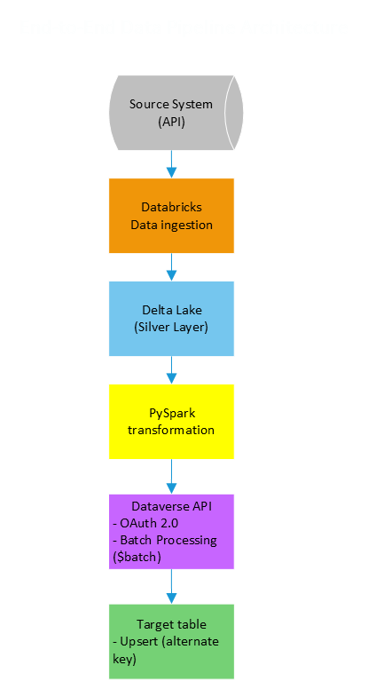

# 🚀 Databricks → Dataverse Integration Pipeline

End-to-end data integration pipeline that ingests, transforms, and synchronizes structured data from a Delta Lake (Databricks) into Microsoft Dataverse using REST API and OAuth 2.0 authentication.

⚠️ This project is a sanitized version of a real-world enterprise implementation.
All sensitive information was removed and replaced with generic examples.

---

## 📌 Overview

This project demonstrates the implementation of a robust data pipeline designed to:

- Extract and process structured data in Databricks
- Perform data cleaning and transformation using PySpark
- Integrate with Microsoft Dataverse via REST API
- Execute **UPSERT operations using alternate keys**
- Optimize performance using **batch processing ($batch)**

---

## 🏗️ Architecture


---

## ⚙️ Technologies Used

- Databricks
- PySpark
- Delta Lake
- Python (requests, json)
- Microsoft Dataverse Web API
- OAuth 2.0 (Client Credentials Flow)
- REST API Integration

---

## 🔑 Key Features

### ✅ Secure Authentication
- OAuth 2.0 (Client Credentials Flow)
- Service-to-service integration via App Registration

---

### ✅ Upsert Logic (Idempotent Loads)
- Uses **alternate key (employee ID)**
- Ensures:
  - Existing records are updated
  - New records are created
- Prevents duplication

---

### ✅ Data Transformation
- Data type conversion (dates, numerics)
- String sanitization
- Null handling
- Schema mapping (source → Dataverse logical names)

---

### ✅ Metadata-Driven Schema Validation
- Dynamic schema validation using Dataverse metadata API
- Avoids invalid payload issues

Example:
```
http
GET /api/data/v9.2/EntityDefinitions(...)
```

---

### ✅ Batch Processing ($batch)

- Groups up to 100 records per request
- Reduces API overhead
- Improves performance significantly

Approach
Execution Time
Row-by-row ~15 minutes
Batch ($batch) ~1–2 minutes ✅

---

## 🧠 Challenges & Solutions

### 🔴 Authentication Issues
- AADSTS500011 error due to incorrect resource URL
- ✅ Fixed by correctly configuring OAuth scope

### 🔴 Invalid Field Names
- Payload rejected because of incorrect logical names
- ✅ Solved using metadata API discovery

### 🔴 Performance Bottleneck
- Slow execution due to one request per record
- ✅ Implemented batch processing ($batch)

### 🔴 Payload Errors
- Dataverse rejects invalid fields silently
- ✅ Solved via field validation and cleaning logic

---

## 📊 Example Data (Sanitized)
```
{
  "employee_id": "1001",
  "name": "Fulano de Tal",
  "job_title": "Operator",
  "department": "Operations",
  "hire_date": "2022-01-01"
}
```

A sample dataset is provided in `sample_data.json` to demonstrate the expected input structure.

This dataset is fully anonymized and intended for demonstration purposes only.


## 🔄 Upsert Request Example
```
PATCH /api/data/v9.2/employees(employee_id='1001')
```
```
{
  "employee_name": "Fulano de Tal",
  "job_title": "Operator"
}
```

---

## 🔐 Security Considerations

- No real credentials or endpoints exposed
- All identifiers are anonymized
- Sample data replaces production data
- Secrets stored outside code (e.g., Key Vault / secure storage)

---

## 🚀 Future Improvements

- Incremental loading (based on timestamp)
- Retry mechanism for failed batches
- Parallel batch execution
- Data quality validation layer
- Logging and monitoring

---

## 📈 Results

- ✅ Reduced execution time by ~80%
- ✅ Eliminated duplicates via alternate key
- ✅ Scalable for large datasets
- ✅ Production-ready architecture

---

## ⭐ Key Takeaways
This project demonstrates:
- Real-world API integration challenges
- Data engineering best practices
- Performance optimization strategies
- Enterprise-grade pipeline design

---

## 👤 Author
Data Analytics Intern

Focus: Data Engineering, Automation & Business Intelligence

